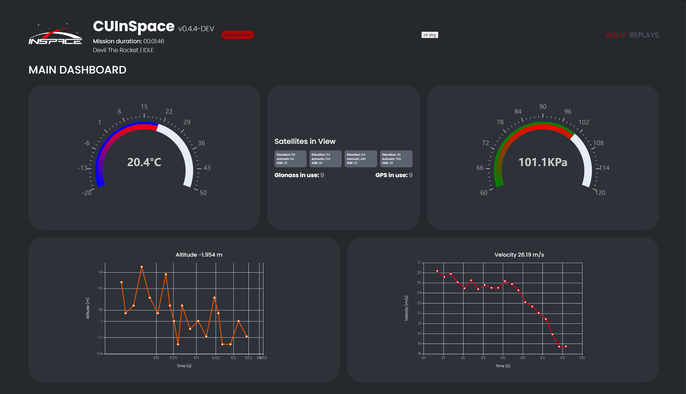
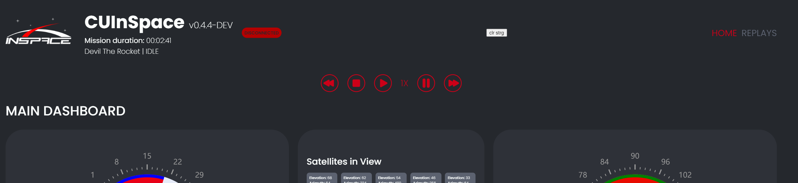

<h1>Ground Station UI</h1>
<h3>CUInSpace</h3>

[](https://opensource.org/licenses/MIT)

Visualizes real-time telemetry data from the CUInSpace rocket. Telemetry data is parsed by the Python backend and sent
over websocket as JSON to the frontend.

## Dashboard Preview
 (outdated image but it looks similar)

## Overview

The dashboard visualizes data on different charts using Apache ECharts. Temperature, pressure, velocity and altitude are
displayed among other indicators. Flight time is tracked using the mission timer component.

The UI fundamentally makes use of a websocket connection to the 
[Python backend](https://github.com/CarletonURocketry/ground-station), which sends telemetry data in real-time as it 
receives it from the rocket transmission chip. This data is sent in JSON format, where it is unpacked and displayed in 
chart components.

Please see [websocket.json](https://github.com/CarletonURocketry/ground-station/blob/main/static/websocket.json) for an 
example of incoming data.

The dashboard also has capacity to replay recorded mission data for simulation and analysis purposes. A control panel
with stop, start and replay commands is available using the key command `Shift + C`. Various other keyboard commands are
being implemented to allow for direct communication with the rocket's telemetry chip.



The dashboard attempts re-connection to the websocket automatically, and displays that there has been a connection issue
in the dashboard header. A set of historical data from each telemetry category is kept in local storage in order to 
maintain a static display of the most recently received data when connection becomes unstable.

## Technologies
- HTML
- CSS
- ReactJS
- NodeJS
- Python (backend)
## Libraries
- [Visx](https://airbnb.io/visx/)
- [React LeafletJS](https://react-leaflet.js.org/)
- [React Grid Layout](https://github.com/react-grid-layout/react-grid-layout)
## Installation

Install ground-station-ui with npm

```bash
  git clone https://github.com/CarletonURocketry/ground-station-ui.git
  cd ground-station-ui
  npm install
  npm run start
```
    

## Documentation
Please visit [the repository's wiki](https://github.com/CarletonURocketry/ground-station-ui/wiki) to view the documentation for this project.

## Contribution
To contribute to this project, please view the [contribution guidelines](https://github.com/CarletonURocketry/ground-station-ui/wiki/Tutorials#contributing-guidelines) on the [repository's wiki](https://github.com/CarletonURocketry/ground-station-ui/wiki).

## Contributors
- Matteo Golin
- Hamnah Qureshi
- Grant Achuzia
- Ryan Diep
- Eshan Betrabet
