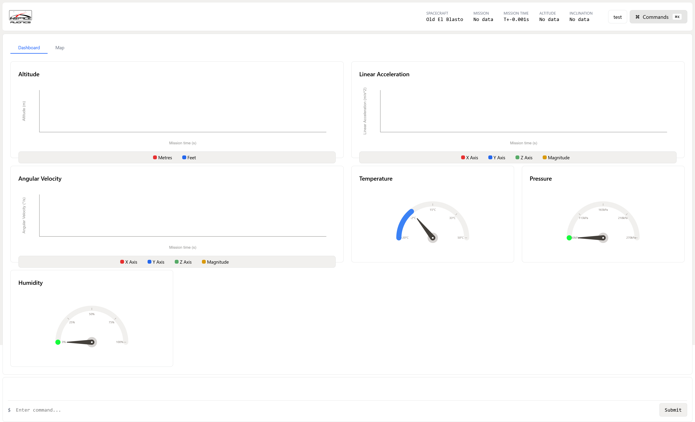

# Ground Station UI

This repository contains the UI for CUInSpace's telemetry backend. It is a React application bundled using Vite and connects to our [Python ground station](https://github.com/CarletonURocketry/ground-station) using web sockets.

<!-- TODO: Get a better picture with live data -->

## Features
The ground station UI comes complete with features such as:
- Dynamic scatter plots for displaying altitude and IMU data over time
- Guage components for displaying live temperature, pressure and humidity data
- A command palette for ease-of-use in our launch console
- A 2D satellite imagery map for tracking the rockets location
- (*Coming soon*) A 3D satellite imagery map for tracking the rockets location and altitude 

<!-- TODO: Add a side by side view of the 2d and 3d maps -->
<!-- Refer to this: https://stackoverflow.com/questions/24319505/how-can-one-display-images-side-by-side-in-a-github-readme-md -->

## Installation & Quick Start
The ground station UI by itself isn't all that useful as it requires the [ground station backend](https://github.com/CarletonURocketry/ground-station) to obtain data and replay past missions. The recommended method of deploying both the ground station UI and backend is described in the [ground-station-complete repository](https://github.com/CarletonURocketry/ground-station-complete) which uses docker containers and deploys an optimized version of the frontend. That being said, if you'd just like to checkout the frontend, here are the steps to take:
1. Ensure that you have an up-to-date version of Node or Bun installed (we normally use the latter)
2. Clone this repository and navigate into the cloned directory
3. Install dependencies with `bun install`
4. Launch the development server using `bun run dev`
